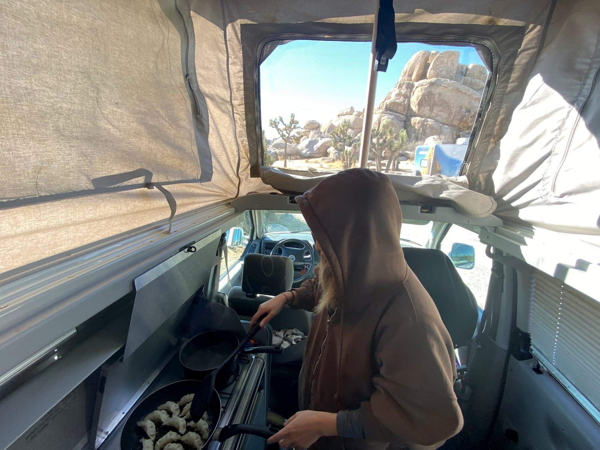
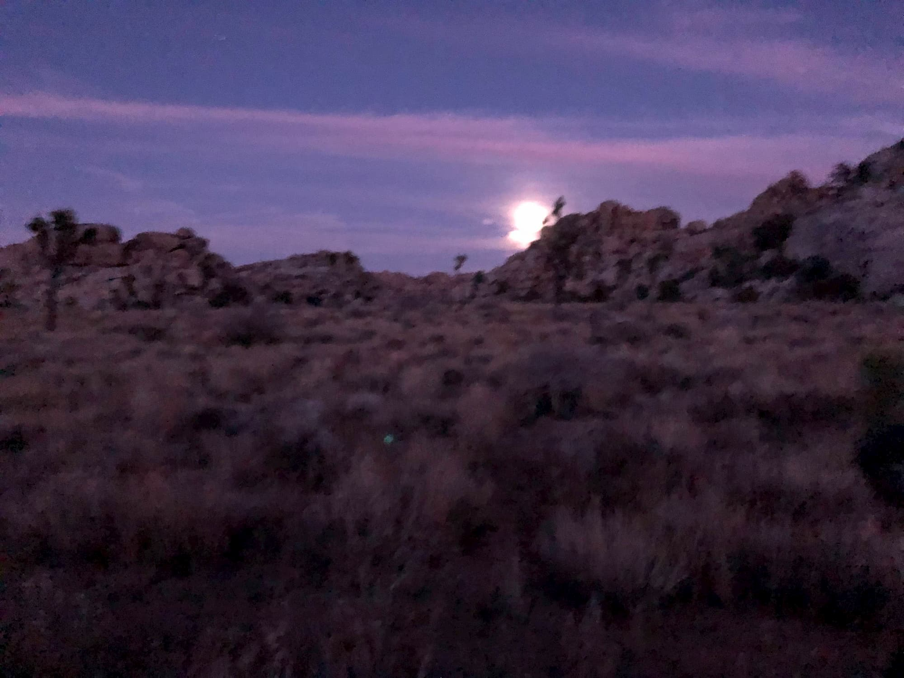
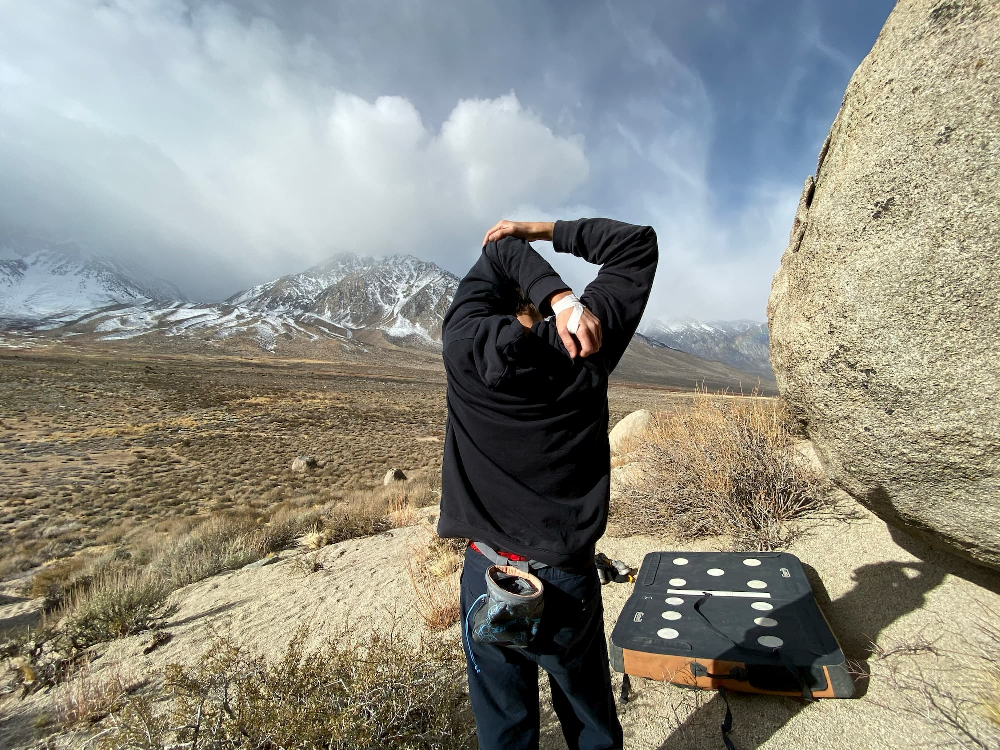
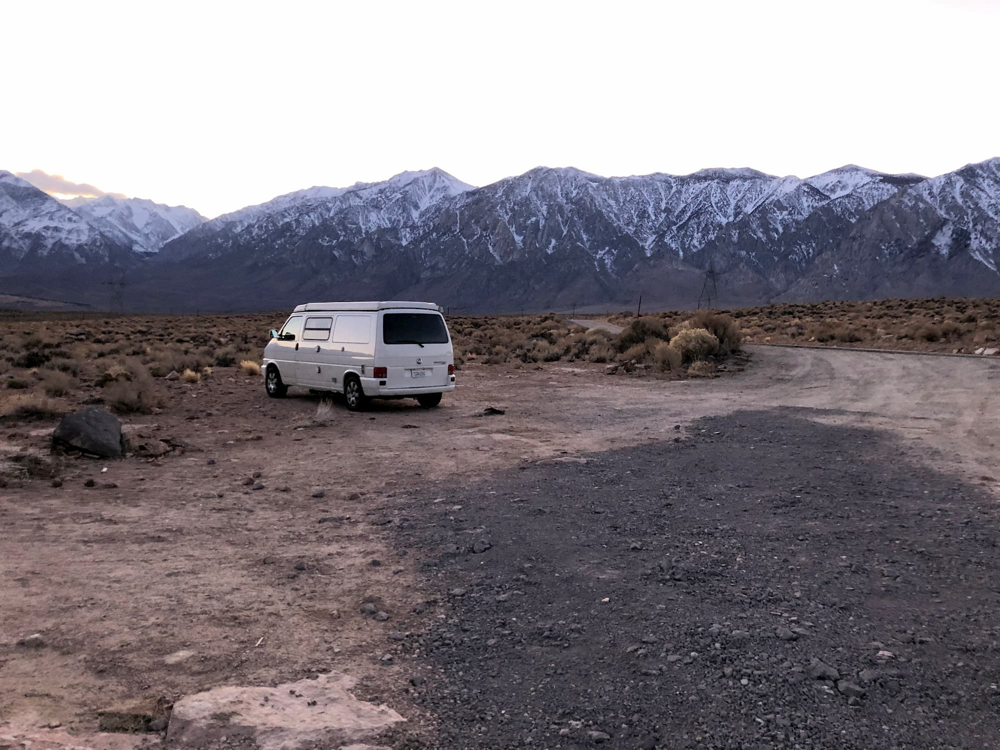
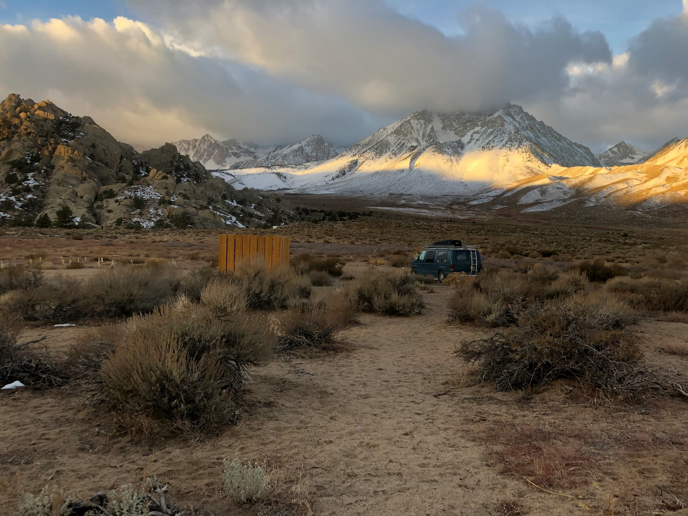

My girlfriend and I usually go back to the USA for Christmas, to visit my family and do some traveling. We first went to Chicago, for my mother's birthday celebration, then went straight out to California for a big adventure. 

To be totally honest, we barely had anything planned apart from the vehicle. We rented a van on [Outdoorsy](https://www.outdoorsy.com/), a really nice platform which is basically the Airbnb of vans. We found a van we liked, a [2000 Volkswagen Eurovan named Walter](https://www.outdoorsy.com/rv-rental/lakewood_ca/2000_volkswagen_winnebago_46412-listing), and headed off to Los Angeles for the pickup. 

Our original "plan" was to go to Red Rock Canyon, just outside of Las Vegas. Nice sandstone bouldering in the desert, perfect for winter. When we landed in Los Angeles to pick up the van, however, we heard that it recently rained in Red Rock, which makes bouldering there impossible for about 1 week. New plans needed.

We decided on Joshua Tree, which luckily is only a 2 hour drive from Los Angeles. We picked up the van (owner was a very nice guy) and set off for Joshua Tree.

We stayed there for about 4 days, climbing and chilling in the van. Absolutely stunning moon-like scenery. Endless boulders to climb. Paradise part one.

Places in Joshua Tree we climbed:
* Hidden Valley
* Real Hidden Valley
* Ryan Campground
* Stonehenge Boulders

We also checked out the sport climbing opportunities in Joshua Tree. Terrifying. Keep in mind this place was developed by psycho climbing purists in the middle of the desert. Two words: run out. The distance between bolts was very far, you would be better off bringing some trad gear to sport climb here.

After Joshua Tree, we drove up to Bishop, California. Another great place for bouldering in the winter. Nestled in the Sierra Nevadas, we spent half the time just enjoying the breathtaking vistas. 

Another big plus of the area: most of this place is owned by the Bureau of Land Management, which means you can park and camp literally anywhere. We drove up to the area known as Buttermilks Country and parked up there. 

The climbing here is...intense. Not as beginner friendly as Joshua Tree, which is already not-beginner-friendly at all. Most of the boulders here are considered highballs, 15-20 feet tall rocks that you hit a certain halfway point "no fall zone". We still got a lot of good climbs in.

Areas we climbed in:
* Buttermilks Country
* Happy Boulders

We barely scratched the surface here. Tons of blocks to be had. Hope to go back someday when I'm a stronger climber, and can really get some big sends on those massive blocks in Buttermilks. 

Overall, awesome. I think more van climbing trips are in my future.

_Key visual: our van parked in Joshua Tree at night_