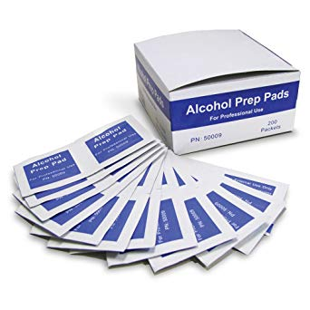

At the time of writing this, I have already endured about six weeks of complete coronavirus lockdown while living in Shanghai. The outbreak here has been taken **very seriously**, and we have altered our lifestyle accordingly. Although the outbreak has been well-contained in Shanghai with relatively few cases, several confirmed cases were found right down the street from my apartment -- literally just outside my front door.

In other words, the chance of being infected with Covid-19 is a very real threat in my life. That being said, at the time of writing this, the virus is just taking hold back home in the USA. With absolutely no bias towards the USA or China, I can say with little hesitation that the USA is not as uniquely equipped to deal with a deadly virus outbreak as Mainland China. I guess there are some advantages that come with a communist dictatorship.

Anyways, that's probably a different topic, what we're really here to talk about: **Hot Tips for surving Covid-19**.

### Do Not Freak Out
When the outbreak first became "serious" in China around the end of January, there was a nationwide **panic**. You could literally walk outside and see people having public meltdowns related to the virus. In my opinion, the public hysteria surrounding the panic is an even greater risk than getting infected. 

One very real problem the panic created: hoarding of medical supplies and masks, as well as hoarding of toilet paper and daily necessities. China was already the world's biggest market for face masks, there's absolutely no reason for a shortage other than hoarding -- both consumers and idiotic local governments were hoarding supplies. 

Another problem created by the panic: mental instability. People lost their lives in Covid-19 not due to the virus, but the hysteria created by the perceived threat of the virus. This manifests in many ways. Someone down the street from me jumped off the roof of their building to their death in the second week of the virus. I don't know the full story there, but I doubt it's unrelated to the outbreak.

Last thing I observed related to the panic: general distrust of others and a hostile environment. People were quick to point fingers, and there was a generally hostile vibe in any public place. 

### Wear your face mask
Some news sources will say that wearing a face mask actually increases your risk of getting infected. That's idiotic. It's not as much for protecting yourself as it is for protecting others -- **you** could be infected. Wear your mask.

Also, this relates to the general panic issue and not freaking out. Currently, if you appear in a public place in Shanghai without wearing a face mask, you're likely to be confronted and asked to put on a mask. It's the courteous thing to do.

Also, Covid-19 can be passed through droplets in the air. So, yeah, it is airborne.

Surgical mask or N95, both okay. Don't use the same one for more than 2 days.

Useful: [How to dispose of your used face mask.](https://www.youtube.com/watch?v=PCDev6SW7AU).

### Don't wear your shoes in the house
This goes without saying in China, as it's already part of the culture to remove your shoes when entering the home. For some reason, American culture has this kind of gross habit of wearing outdoor shoes while walking around the house. The virus could easily enter your home this way, change your habits!

Buy some slippers, or have a dedicated pair of flip flops for wearing around the house. 

### Alcohol wipes
Buy some alcohol wipes, use them to wipe down any personal items you used outside, like your phone, keys, wallet, etc.

Carry a few with you everywhere and use them liberally.

### Obviously: don't touch things in public

Whenever I go outside, I think of it like playing "the ground is lava", except instead of the ground it's "every public surface", and instead of lava it's "a deadly infectious virus that can kill you or give you permanent lung damage".

Useful: [coronavirus life hack.](https://www.youtube.com/watch?v=uLQPi8UYhik)

### Other tips

* **Don't be racist towards Asians** - obviously, please.
* **Don't trust government or media too much** - use common sense, look to the medical community as a trusted source, and learn to identify misinformation.
* **Get a UVC light** - we have one in the home and use it to disinfect all of our clothes that we wore outside.
* **Avoid crowded public areas**
* **Work from home** - If possible.
* **WASH YOUR HANDS LIKE A DEMON**

That's about it. This is how I have, thus far, avoided infection.

_Key visual: Me, on a daring excursion in Shanghai's metro._