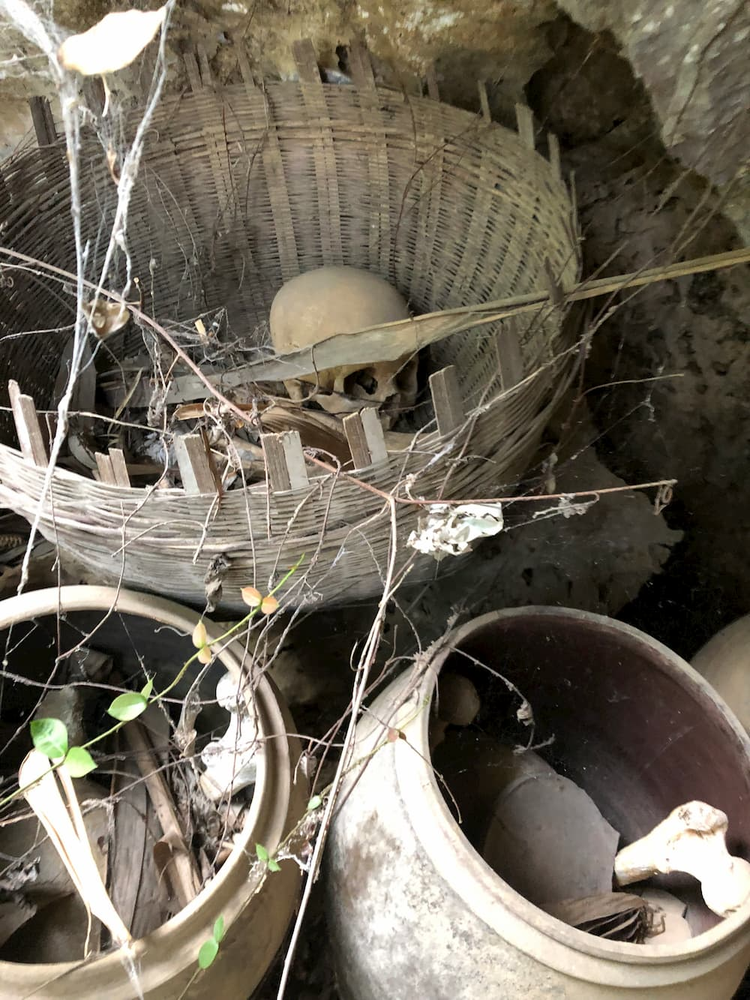
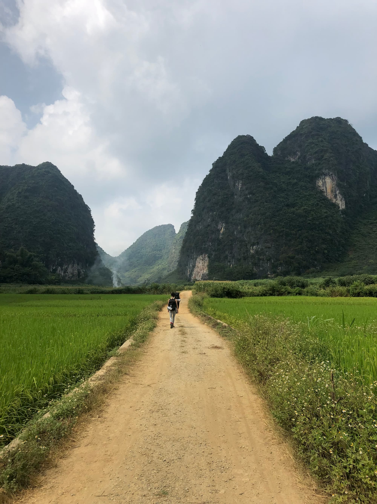

This past week was the Chinese National Holiday, so we had a week of holiday from 10/1-10/7 to do whatever we wanted. We've been quite into sport climbing lately, like, really into it. We've been wanting to go to to Yangshuo, a popular outdoor climbing spot in China, but it's pretty crowded this time of year, not only with climbers but also general Chinese tourists checking out the natural beauty. A few of our climbing friends mentioned a trip to a new-ish climbing location being developed near Yangshuo called Mashan. Similar pockety limestone crags on endless mounds, but without the crowds of Yangshuo. We decided to tag along for a 5 day trip.

## 9/30 - Day 1
We took an early flight from Shanghai to Nanning, Guangxi. About a 3 hour flight for a reasonable price from Spring airlines.

This was still technically a work day, so we just went straight to the hotel and worked all day. Not much interesting to be said here. Our friends were still on the way, so we just chilled and worked out of the hotel.

## 10/1 - Day 2

After Shanghai - Nanning, next is a roughly 2 hour drive from Nanning - Mashan. We met up with our friends at around 9:30 AM for the drive. The driver is a local climber from Mashan. We stuffed all our climbing gear in his SUV and took off. 

We got in to Mashan around 11:30ish, got settled into our rooms and headed out to the crag around 1.

### Ganniang Mtn./干娘山

We went to one of the more popular crags this day -- [Ganniang mountain](https://www.thecrag.com/climbing/china-mainland/guangxi/area/2143383489). Lots of climbs there, but it got VERY crowded later in the day after the sun eased off the side of the crag. There's also a shallow cave here, which has some 20 lines in it. I went straight for a 5.11a in the cave and got my ass handed to me.

Climbing here was pretty decent, albeit overcrowded. We stayed until the sun went down and walked back to the dark. Got some dank lamb in town before calling it a night.

## 10/2 - Day 3

### King Kong Mtn./金刚山
For our second day of climbing, we went to the most popular crag in Mashan - [King Kong Mtn](https://www.thecrag.com/climbing/china-mainland/guangxi/area/2143383429). Tons of routes here, including a few multipitches. But **INCREDIBLY OVERCROWDED**. We spent the entire morning here, got a few climbs in, but we were kind of dissapointed. We came here to escape the crowds of Yangshuo.

### Goat Mtn./羊山
In the afternoon, we headed over to a smaller crag to get away from the sun + people at King Kong. Little crag called Goat mountain. Climbing was not great -- overgrown, wild, incredibly sharp rock. It was still a blast though, and I climbed a cool 30 meter 5.10c. Only after climbing it, did I realize I had to step over literal human remains to get to the first bolt. 

 In this part of Guangxi, locals have an ancient custom for sending their loved ones to the afterlife. They bury their dead, wait for them to decompose, then dig up the remains and put them in a big ceramic pot, and place it on a mountain somewhere. Most metal thing I've ever heard.

 ## 10/3 - Day 4

 ### Neihuan/内环

 There are a **plethora** of newly bolted crags in Mashan at the time of writing this. A member of our party picked out a crag with a lot of 5.10 - 5.11 level climbs for us to explore, and we set off to [Neihuan](https://www.thecrag.com/climbing/china-mainland/guangxi/area/2177445438). The approach was a bit confusing, we couldn't really find the trail and one of our buddies got stung by a wasp on the way up. When we got up there, though, it was totally worth it. Lots of great climbs, some of which have never even been FA'd yet. 

 I decided I also wanted to make an attempt at my own first ascent. I picked one out of the top, in which the rating was written as `5.10?`. It was pretty easy until the top, when you need to pull yourself up over a sizable roof of about 1 meter, get your legs over the roof and pop up to the anchor. 

 I made it up over the roof, and right when I was about to go for the anchor my hand slipped and I took a big fall. My first big whipper. Got banged up pretty good and was bleeding in about 12 places. Luckily I was wearing a helmet. Another member of our party ended up trying it, flashing it, and naming the route ["Johnny's Demise"](https://www.thecrag.com/climbing/china-mainland/guangxi/route/2763888354) in honor of my epic whipper.

 
 > Chyah climbing an epic tufa at neihuan

 ## 10/4 - Day 5

### Caizhi/才支

We decided to go to another newly bolted crag in search of more first ascents. Someone from our group decided [Caizhi](https://www.thecrag.com/climbing/china-mainland/guangxi/area/2177443092) looked promising and we again set off for our last day of sends.

Absolutely beautiful setting, and plenty of climbing to be had. 

Even though the routes are new, the vegetation/growth did not really get in the way, and the routes were relatively clean all things considered. I ended up getting a few FA's myself and got to name a few routes. Super cool experience. My favorite climb was a 26 meter 5.10b which I named "The Blue Lotus". Straight vertical climb, with a few crimpy sections, and an awesome view from the top. 

The next day, we got up at 5 and began the journey back to Shanghai, totally wrecked from a full 4 days of climbing. I've only been climbing for about one year, so that's about my limit in terms of volume. 

End of summary.