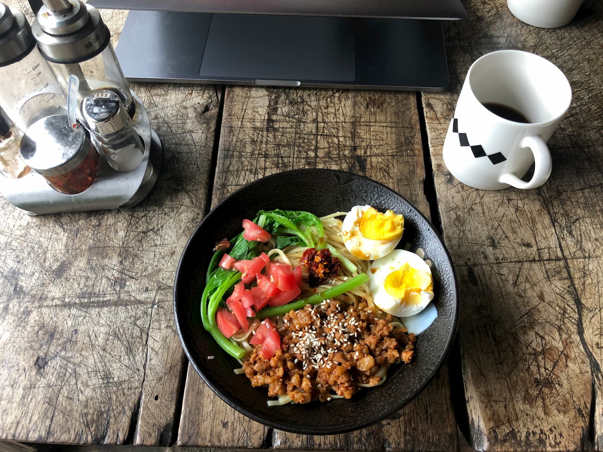
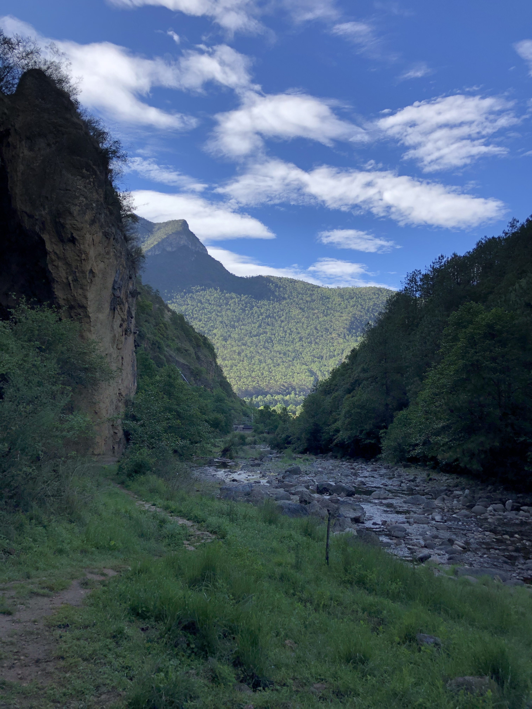
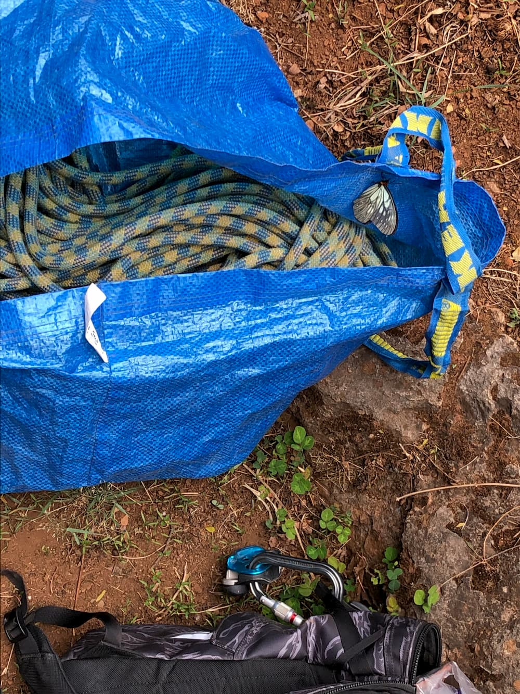
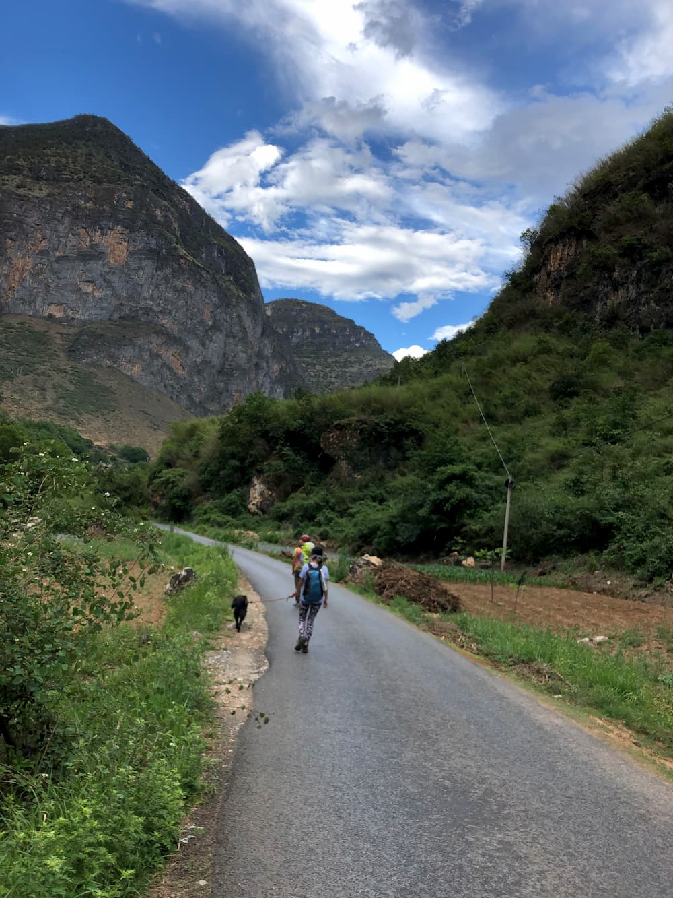
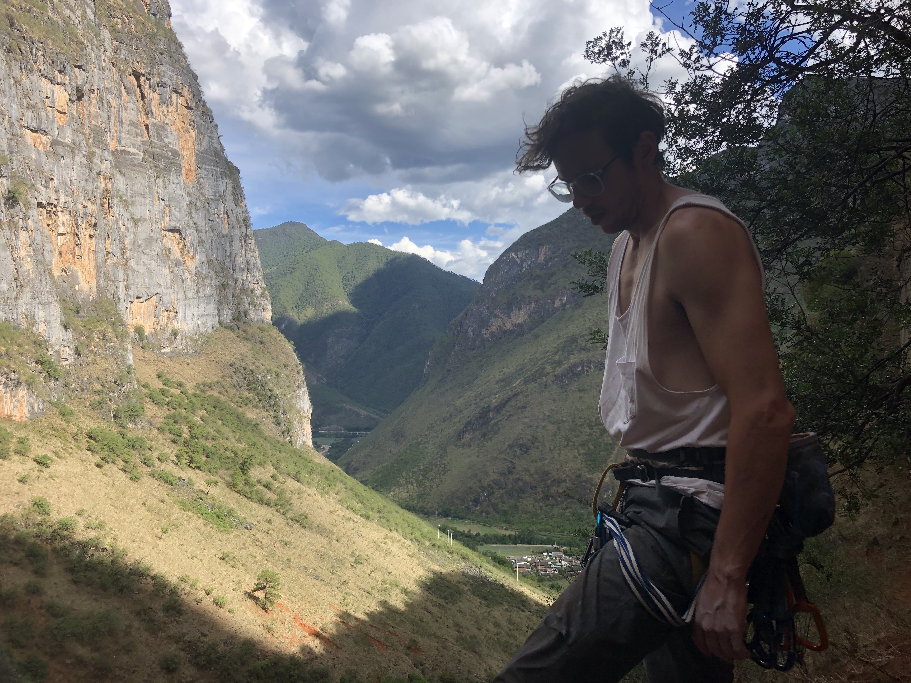

Last week, my girlfriend and I went on yet another epic rock climbing trip. 

Shigu, Yunnnan, China -- Chinese name 云南省丽江市石鼓镇

For more information, checkout [climbshigu.com](http://climbshigu.com/). The hostel is owned by a British dude who has helped develop the area for climbing. Great food, as well. Delicious Yunnan coffee available every morning.

This is 100% without a doubt my favorite climbing spot in China.

The style is, like many climbing destinations in China, pocket-filled limestone with tons of tufas. The climbing here is actually pretty varied, though. You can find any kind of climbing style here: technical climbs, slabby rocks, huge vertical reachy routes, or for people like me -- juggy overhang tufa stuff.

I don't even know what to say, other than it's incredibly beautiful there. I'm starting to question quality of life in Shanghai -- people in Yunnan are living their best lives, with much healthier food, local coffee, and incredible climbing right outside their front door. 

I plan to go back when I have another opportunity, I have some unfinished projects that I didn't send.

_Key visual: me on a route at diamond wall with a rainbow in the background_

