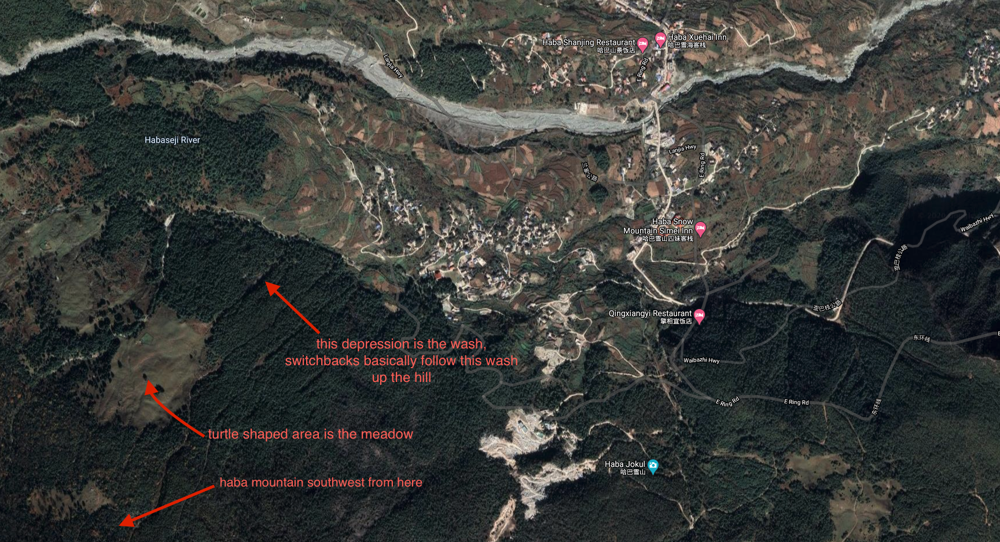

# Haba Mountain

Haba Mountain (哈巴雪山) is a snow-capped mountain in Shangri-la county, Yunnan province, China. [Wikipedia link](https://en.wikipedia.org/wiki/Haba_Snow_Mountain). At 5,396 m (17,703 ft), it's a serious peak, but apparently a relatively easy climb.

### Access

Get a driver to Haba village (哈巴村). Haba village is about 3-4 hours from Lijiang.

A common approach is to go directly to Haba after hiking Tiger Leaping Gorge. Haba village is about a 1.5 hour drive from Tina's guesthouse at the north end of Tiger Leaping Gorge. Overall, if I could go back, I would skip Tiger Leaping Gorge (it's crawling with scammers trying to trick you into all kinds of ripoffs).

**Note:** At the time of writing this, there is a huge bridge construction project across the Yangtze/金沙江, which adds potential traffic jams to your journey. If unlucky, from Lijiang it can take 5 hours; 3 hours from Tina's.

#### From Haba Village

There are a few guesthouses right in Haba focused on helping climbers summit, providing services like guides and gear rental for a summit attempt, etc. If time allots, you couild go directly to Haba village and ask from there. It's probably an extra 40 minutes to hike from the village and see everything along the way to the trailhead. Refer to [the first half of this guide](http://www.itinerantclimberscollective.com/haba-beta/) about how to reach the trailhead from the village.

#### From Haba Clouds

If you don't want to spend time in the village, you can have your driver take you directly to a guesthouse particularly close to the trailhead called Haba Clouds, chinese name: 云上哈巴. From here, it's just a 5ish minute to the trailhead. The people there are also extremely nice. We stopped there to get some noodles before the hike, and they gave us some beta about the hike and let us store some of our belongings there.

From Haba Clouds, you can ask the owners or refer to the guides below about how to get to the trailhead. The gist of it is:

- Walk straight out haba clouds, past the sign.
- Roughly 2 minutes later, turn right at the first small intersection, and start walking upwards. Your goal is to get to the "top of the village".
- Look for a basketball court about another 2 minutes later.
- Walk straight past the basketball court, towards a bridge.
- Cross the bridge and turn right, following the flags.
- Keep going straight for about 5-10 minutes, you'll come to one more stream crossing and a country road.
- Cross the road straight and start heading uphill.
- From here, the trail should be fairly obvious. 

There are porters using donkeys to haul the bags (and sometimes, person) of Chinese peak-seekers up and down the mountain all day. This makes the trail pretty obvious, so, if in doubt, just follow the trail of donkey droppings. The donkeys do really bang out the trail, though, and sometimes the switchbacks do seem to diverge. Just generally keep going up, following a washed out stream.

### Camping on The Meadow

We're not actually equipped (physically or gear-wise) to climb Haba. It's a big commitment, plus we only have one day. A *lite* option for a Haba excursion is to camp on the meadow part of the way up. The meadow is maybe 800 or 900 meters above Haba village, and is accessible in a 1.5-3 hour hike, depending on your fitness level.

You can actually see the meadow from Haba village, and if you want to get some directions from Haba Clouds or other locals, just ask about "黄土坡" or generally "那个草坪". Tell them you're **not** going to basecamp (大本营) but just to the meadow, which is way before basecamp.

#### Location
The meadow should be pretty obvious when you hit it. This map can also help.

You can also use a maps app on your smartphone. You should have signal all the way up, and including in the meadow. The signal might be spotty, they appear to round-robin service to mobile nodes in the region, so your service will temporarily drop sometimes.

If using a maps app, the meadow is a turtle-shaped green area just up the hill from Haba village.

#### Pictures
Some pictures from camping on the meadow.

### External resources

- [This guide on the outbound](https://www.theoutbound.com/china/backpacking/camp-on-haba-snow-mountain-huangtupo-camp) - gave us the original idea about camping on the meadow.
- [Full beta for climbing](http://www.itinerantclimberscollective.com/haba-beta/) - an advanced guide on actually summitting.
- Haba clouds wechat contact: wxid_bkqiw8zxktzm22
- Driver dispatcher for the area wechat contact: wxid_xqc0lnicqa5d22

