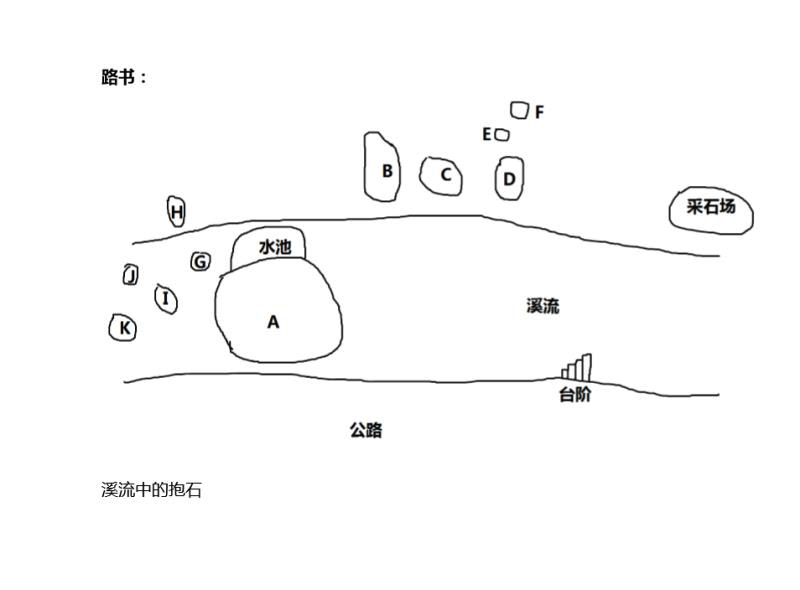
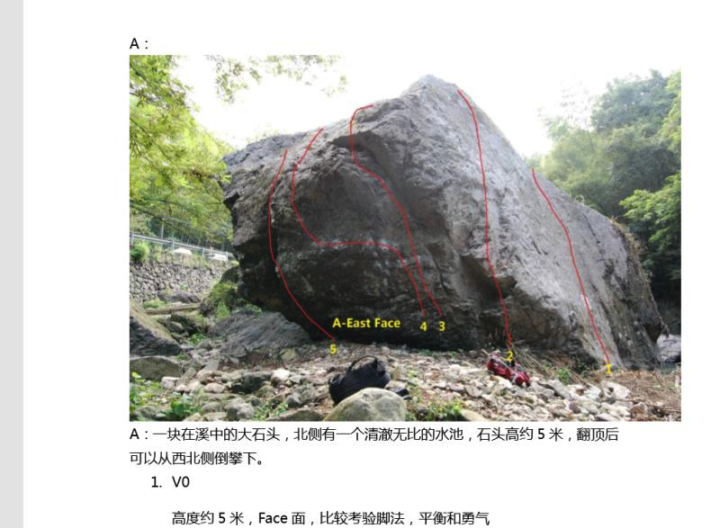
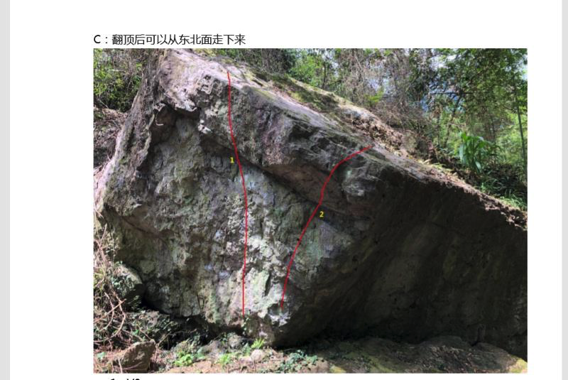
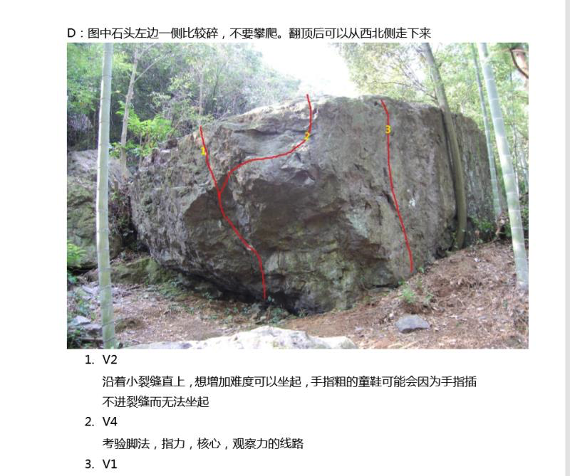
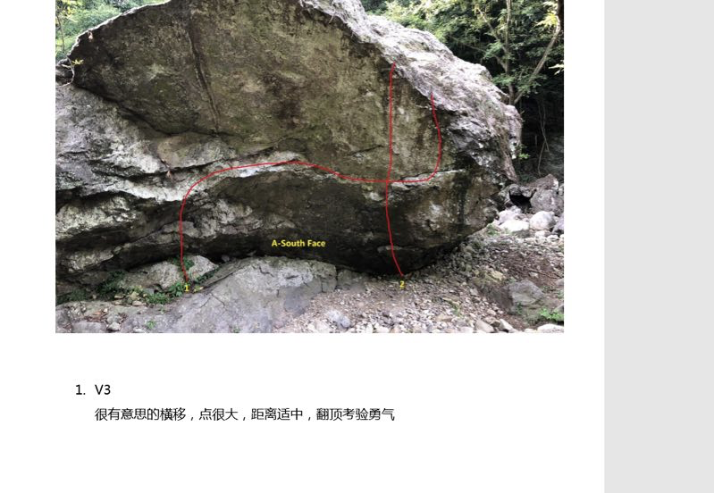
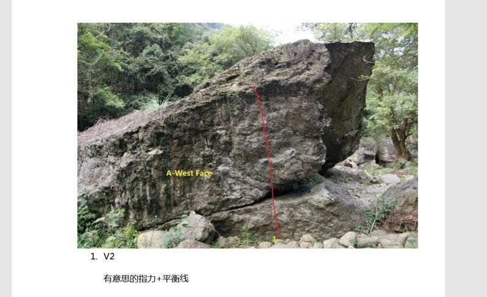
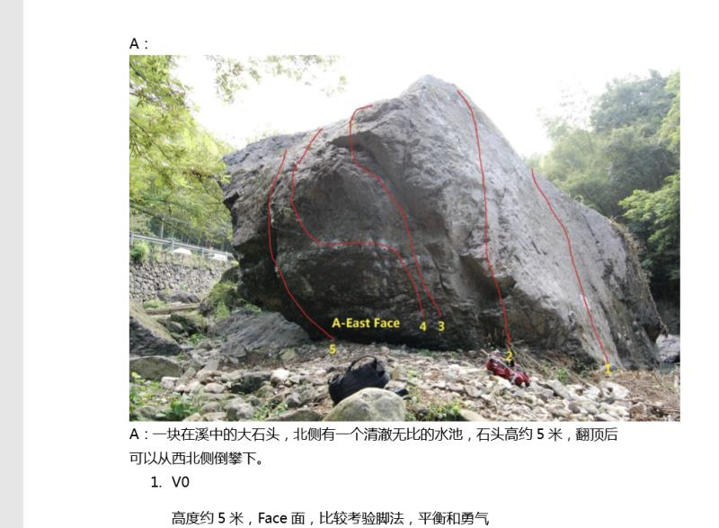
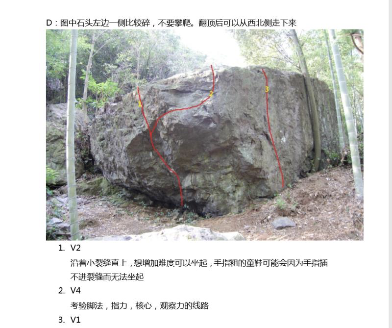

# Ningbo Bouldering

- The crag →
    - [https://www.thecrag.com/routes/at/2325981987/with-gear-style/boulder/](https://www.thecrag.com/routes/at/2325981987/with-gear-style/boulder/)
    - [https://www.thecrag.com/climbing/china/zhejiang-jiangsu/area/2326002222](https://www.thecrag.com/climbing/china/zhejiang-jiangsu/area/2326002222)
- Coordinates: 29.738714,121.264385

[Google Maps 1](https://maps.apple.com/?address=Ningbo,%20Zhejiang,%20China&ll=29.738714,121.264385&q=Ningbo&_ext=EiYpCf63kh3bPEAx+wPltn06XkA5JsXHJ2RTPkBBQdMSK6ORXkBQDA%3D%3D)

[Google Maps 2](https://maps.apple.com/?address=Ningbo,%20Zhejiang,%20China&ll=29.738714,121.264385&q=Ningbo&_ext=EiYpCf63kh3bPEAx+wPltn06XkA5JsXHJ2RTPkBBQdMSK6ORXkBQDA%3D%3D)

Basically, follow the coordinates. Once you take the final turn right, to drive up hill with the river on your left, you really only have to drive about three minutes. There are a few turn outs where you can park.

The main boulder is pretty obvious.

This following picture is the most identifiable - the south face is facing the road, and you should be able to identify this v3 traverse route from the road.

